 # Операционные системы UNIX/Linux.  
   
   
   1. [Установка ОС](#part-1-установка-ос)  
   2. [Создание пользователя](#part-2-создание-пользователя)  
   3. [Настройка сети ОС](#part-3-настройка-сети-ос)   
   4. [Обновление ОС](#part-4-обновление-ос)  
   5. [Использование команды  sudo](#part-5-использование-команды-sudo)  
   6. [Установка и настройка службы времени](#part-6-установка-и-настройка-службы-времени)  
   7. [Установка и использование текстовых редакторов](#part-7-установка-и-использование-текстовых-редакторов)  
   8. [Установка и базовая настройка сервиса SSHD](#part-8-установка-и-базовая-настройка-сервиса-sshd)   
   9. [Установка и использование утилит top, htop](#part-9-установка-и-использование-утилит-top-htop)   
   10. [Использование утилиты fdisk](#part-10-использование-утилиты-fdisk)   
   11. [Использование утилиты df](#part-11-использование-утилиты-df)    
   12. [Использование утилиты du](#part-12-использование-утилиты-du)    
   13. [Установка и использование утилиты ncdu](#part-13-установка-и-использование-утилиты-ncdu)    
   14. [Работа с системными журналами](#part-14-работа-с-системными-журналами)     
   15. [Использование планировщика заданий CRON](#part-15-использование-планировщика-заданий-cron) 

# Part 1. Установка ОС

## Графический интерфейс должен отсутстовать. Текущая версия Ubuntu.
1. Выполняем команду: ls /usr/bin/*session.
2. Чтобы узнать текущую версию Ubuntu, выполняем команду: cat /etc/issue.

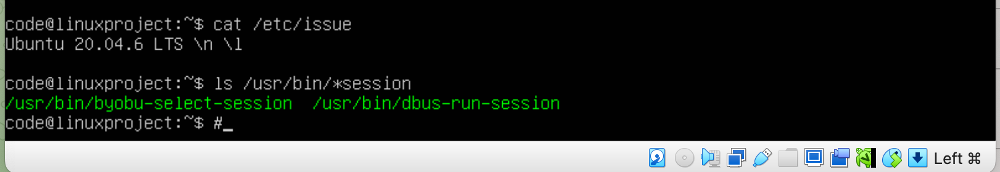

# Part 2. Создание пользователя

## Создать пользователя, отличного от пользователя, который создавался при установке. Пользователь должен быть добавлен в группу adm.

1. Чтобы создать нового пользователя, выполняем команду: useradd с флагами -G и -m. По умолчанию новый пользователь входит только в начальную группу, а с помощью этого флага мы добавляем его в второстепенную группу. Флаг -m создает домашний каталог, так как изначально он не создается по умолчанию.

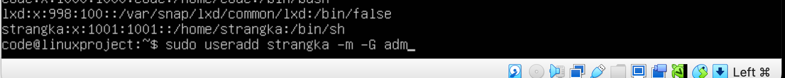

# Part 3. Настройка сети ОС

## Задать название машины вида user-1.

1. Узнаем имя машины с помощью команды: hostnamectl.
2. Чтобы изменить имя машины: используем команду: sudo vim /etc/hostname и вписываем новое имя.

    
Вводим команду: sudo vim /etc/hosts, ищем строку со старым именем и меняем его на новое.

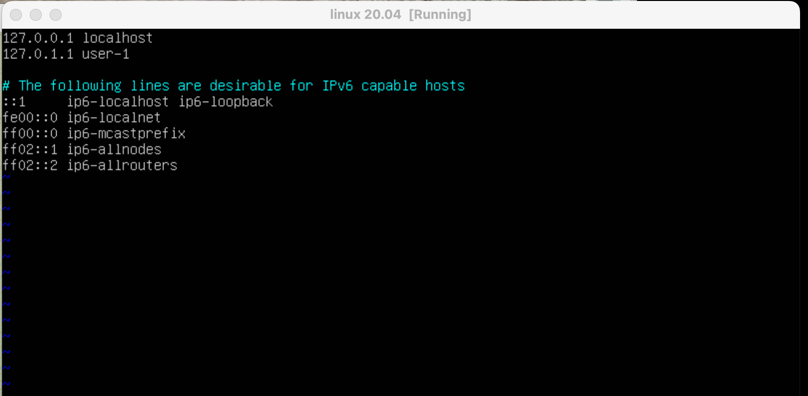

## Установить временную зону, соответствующую вашему текущему местоположению.

1. Чтобы узнать текущую временную зону, вводим команду: timedatectl.

2. Вводим команду: timedatectl set-timezone Europe/Moscow.

## Вывести названия сетевых интерфейсов с помощью консольной команды.

1. Названия сетевых интерфейсов можно узнать с помощью утилиты ifconfig (sudo apt install set-tools). Она выводит информацию о названии, состоянии, IP-адресах, MAC-адресах и тд.

2. Утилита вывела два сетевых интерфейса. Первый — это сетевая карта интернета. Второй — lo (loopback) или локальная петля. Она используется для того, чтобы компьютер мог обращаться к самому себе и имеет по умолчанию IP-адрес 127.0.0.1 на всех компьютерах.

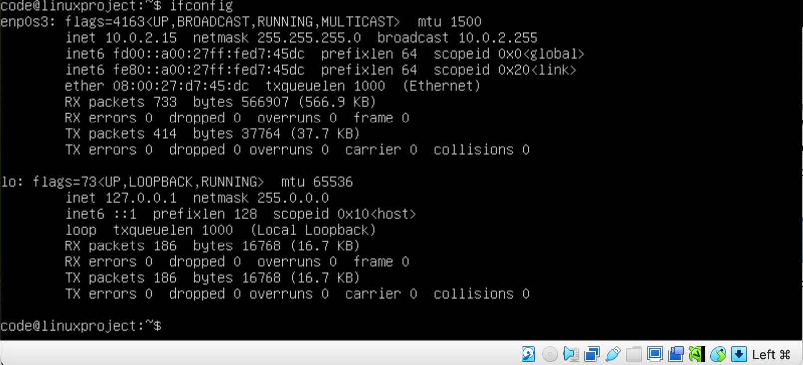

## Используя консольную команду получить ip адрес устройства, на котором вы работаете, от DHCP сервера.

1. Используя команду: ip address, можно узнать IP-адрес и т.д.

DHCP — протокол, который служит для назначения IP-адреса клиенту. Работа этого протокола делится на 4 шага:
- Discovery — изначально клиент находится в состоянии инициализации и не имеет своего IP-адреса. Поэтому он отправляет широковещательное сообщение DHCPDISCOVER на все устройства в локальной сети. В той же локальной сети находится DHCP-сервер.
- Offer — DHCP-сервер отвечает на поиск предложением, он сообщает IP, который может подойти клиенту. IP выделяются из области доступных адресов, которая задается администратором. DHCPOFFER содержит IP из доступной области, который предлагается клиенту отправкой сообщения. Так как нужный клиент пока не имеет IP, для отправки прямого сообщения он идентифицируется по MAC-адресу.
- Request — клиент получает DHCPOFFER, отправляет на сервер сообщение DHCPREQUEST. Он принимает предлагаемый адрес и уведомляет DHCP-сервер. Сообщение почти полностью дублирует DHCPDISCOVER, но содержит в себе уникальный IP, выделенный сервером.
- Acknowledgement — сервер получает от клиента DHCPREQUEST, подтверждает передачу IP-адреса клиенту сообщением DHCPACK. Это сообщение утверждает владельца IP и срок, в течение которого клиент может использовать этот адрес.

## Определить и вывести на экран внешний ip-адрес шлюза (ip) и внутренний IP-адрес шлюза, он же ip-адрес по умолчанию (gw).

1. С помощью команды: ip rout на терминал выводится информация, и мы обращаем внимание на строку, которая начинается со слова default. После этого слова идут данные о внешнем IP-адресе шлюза.

.png)

2. С помощью команды: nslookup localhost узнаем внутренний IP-адрес шлюза. На каждом компьютере он одинаковый — 127.0.0.1. И это не только для ОС Linux, но и для другие операционные системы.

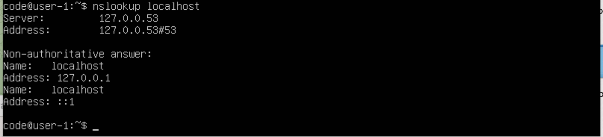
 
## Задать статичные (заданные вручную, а не полученные от DHCP сервера) настройки ip, gw, dns (использовать публичный DNS серверы, например 1.1.1.1 или 8.8.8.8).

1. Для того чтобы задать статичный IP-адрес, используем Netplan в качестве инструмента для управления сетью. Файлы конфигурации Netplan записываются в синтаксисе Yaml. Netplan сам сгенерирует необходимые файлы конфигурации.

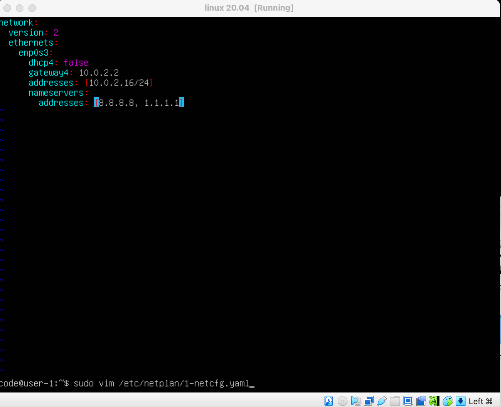

2. Для проверки DNS-сервера, используем: systemd-resolve --status

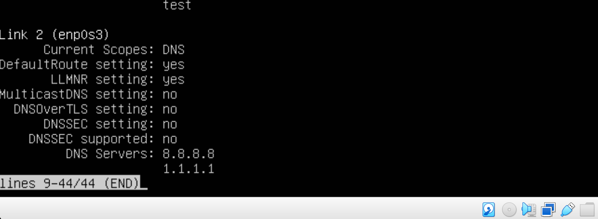

## Перезагрузить виртуальную машину. Убедиться, что статичные сетевые настройки (ip, gw, dns) соответствуют заданным в предыдущем пункте.

1. Для перезагрузки, используем: reboot. Далее с помощью команды ping мы пингуем 1.1.1.1 и ya.ru.

# Part 4. Обновление ОС

## Обновить системные пакеты до последней на момент выполнения задания версии.

1. С помощью команды: sudo apt-get upgrade обновляем ОС до последней версии.

# Part 5. Использование команды sudo

## Разрешить пользователю, созданному в Part 2, выполнять команду sudo.

1. Команда sudo позволяет строго определенным пользователям выполнять указанные программы с административными привилегиями без ввода пароля суперпользователя root. Список пользователей и перечень их прав к ресурсам системы может быть настроен для обеспечения комфортной и безопасной работы.
С помощью команды: sudo usermod -a -G sudo strangka мы добавляем пользователя в группу sudo, чтобы этот пользователь имел право использовать эту команду. Проверяем, что пользователь добавлен в группу sudo.

3. Переходим на другого пользователя, созданного во 2 части, с помощью команды su - stangka. Узнаем hostname с помощью команды hostnamectl.

4. С помощью команды sudo мы открываем файл /etc/hostname и в первой строке пишем новое имя.

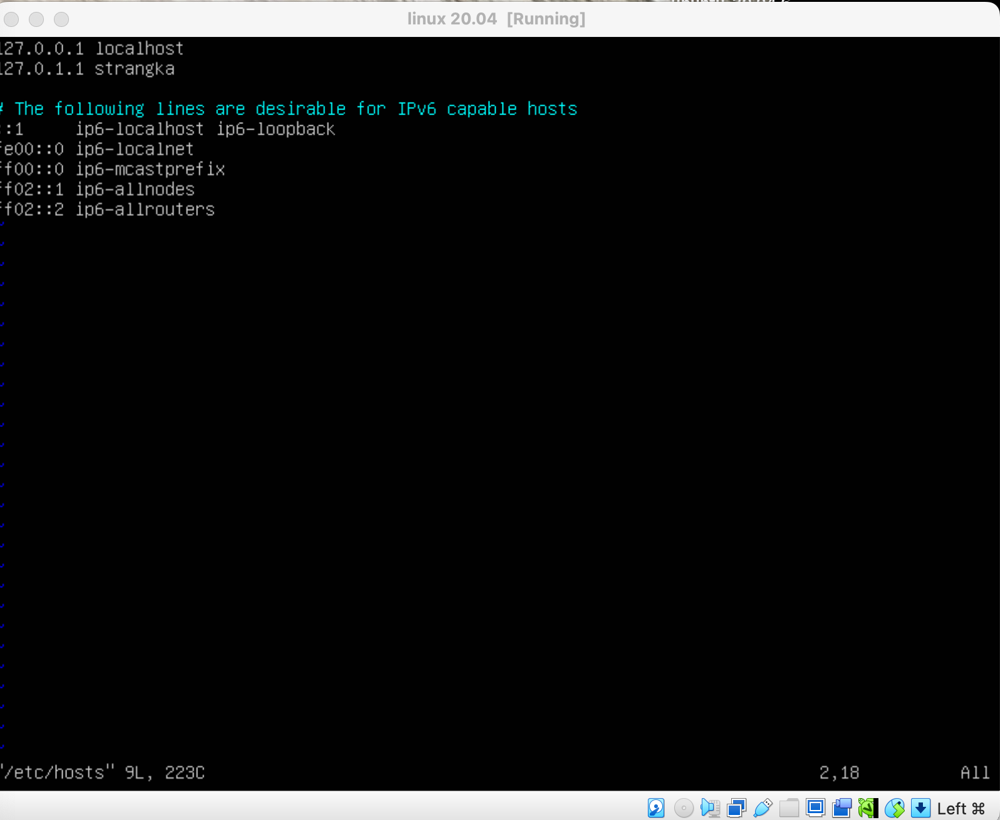

# Part 6. Установка и настройка службы времени

## Настроить службу автоматической синхронизации времени.

2. Выводим команду: timedatectl status и видим, что у нас не синхронизированы часы. Чтобы синхронизировать часы нам нужно установить NTP - протокол синхронизации времени по сети. Для установки вводим команду: sudo apt install chrony/ntp и далее мы заходим в /etc/ntp.conf(/etc/chrony/chrony.conf) и меняем ubuntu на ru.

3. Далее вводим команду: timedatectl show и видим результат на скриншоте.

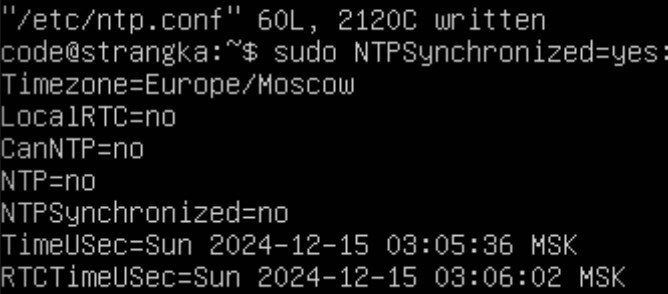

# Part 7. Установка и использование текстовых редакторов

## Установить текстовые редакторы VIM (+ любые два по желанию NANO, MCEDIT, JOE и т.д.). Используя каждый из трех выбранных редакторов, создайте файл test_X.txt, где X -- название редактора, в котором создан файл. Напишите в нём свой никнейм, закройте файл с сохранением изменений.

1. Открываем файл через vim test_vim.txt, жмем клавишу i, печатаем нужный текст, нажимем esc, и для того, чтобы сохранить файл и выйти вводим команду :wq.

2. Открываем файл через nano test_nano.txt, печатаем нужный текст и для того, чтобы сохранить изменения в файле вводим ctrl+o, для выхода вводим ctrl+x.

3. Открываем файл через joe test_joe.txt, печатаем нужный текст и для того, чтобы сохранить изменения в файле вводим ctrl+k , потом X.

## Используя каждый из трех выбранных редакторов, откройте файл на редактирование, отредактируйте файл, заменив никнейм на строку "21 School 21", закройте файл без сохранения изменений.

1. Открываем файл через vim test_vim.txt, жмем клавишу i, печатаем нужный текст, нажимем esc, и  для не сохранения изменений вводим :q!.

2. Открываем файл через nano test_nano.txt, печатаем нужный текст и для не сохранения изменений нажимаем ctrl+x.

3. Открываем файл через joe test_joe.txt, печатаем нужный текст, для не сохранения изменений нажимаем ctrl+c.

## Используя каждый из трех выбранных редакторов, отредактируйте файл ещё раз (по аналогии с предыдущим пунктом), а затем освойте функции поиска по содержимому файла (слово) и замены слова на любое другое.

1. Открываем файл через vim test_vim.txt, печатаем нужный текст, для того, редактирования мы переходим в обычный режим и вбиваем команду :%s/School/strangka/, где команда:
- :s поиск и замена слов.
- % - означает, что мы будем изменять во всем файле.
- School - слово, которое ищем.
- strangka - на какое слово мы хотим поменять. 

2. Открываем файл через nano test_nano.txt, печатаем нужный текст, для редактирования мы нажимаем Ctrl+\, вводим слвов, которое необходимо искать и нажимаем клавишу Enter. Затем вводим слово для замены.

# Part 8. Установка и базовая настройка сервиса SSHD

## Установить службу SSHd

1. Для установки ssh: sudo apt-get install ssh.
2. Устанавливаем openSSH: sudo apt install openssh-server.
4. И проверяем работу ssh-сервера: systemctl status sshd.

## Добавить автостарт службы при загрузке системы

1. Добавляем пакет ssh-сервера в автозагрузку: sudo systemctl enable sshd.

## Перенастроить службу SSHd на порт 2022

1. Меняем порт в конфигурационном файле SSH сервера: sudo vim /etc/ssh/sshd_config.
2. Ищем строку: Port 22. Вместо 22 порта, пишем 2022.
3. Запускаем рестарт ssh-сервера: /etc/init.d/ssh restart.
4. Проверяем: sudo netstat -tulpan | grep ssh.

## Используя команду ps, показать наличие процесса sshd. Для этого к команде нужно подобрать ключи

1. Для нахождения информации о процеесе sshd - используем: ps -fL -C sshd.
   Команда ps - показывает состояние процессов.

2. Определения:
- Флаг -f выводит максимум доступных данных.
- Флаг -L отображает потоки процессов в колонках LWP и NLWP.
- Флаг -С выбирает процессы по имени команды. 

2. Определения:
- UID - идентификатор пользователя. 
- PID - каждый процесс в операционной системе имеет свой уникальный идентификатор, по которому можно получить информацию об этом процессе, а также отправить ему управляющий сигнал/завершить.
- TTY - терминал, из которого запущен процесс.
- TIME - общее время процессора, затраченное на выполнение процессора.
- CMD - команда запуска процессора.
- STIME - время запуска процесса.
- PPID - это идентификатор родительского процесса по отношению к текущему процессу в операционной системе Linux.
- LWP - легковесный процесс.
- TIME - общее время процессора, затраченное на выполнение процессора.
- CMD - команда запуска процессора.
- C - процент времени CPU, используемого процессом.
- NLWP - число легковесных процессов.

## Перезагрузить систему.

1. Вводим команду: netstat -tan

3. Определения:
- netstat - показывает содержимое различных структур данных, связанных с сетью, в зависимости от указанных опций.
- -tan: вывод всех активных подключений TCP и прослушиваемых компьютером портов TCP и UDP + показывает сетевые адреса как числа. netstat обычно показывает адреса как символы.
- State: Listen - ожидает входящих соединений.
- Proto: протокол, используемый сокетом.
- Recv-Q: количество байтов, не скопированных пользовательской программой, подключенной к этому сокету.
- Send-Q: количество неподтвержденных байтов удаленного хоста.
- Local address: локальный адрес (имя локального хоста) и номер порта сокета.
- Foreign address: удаленный адрес (имя удаленного хоста) и номер порта сокета.
- 0.0.0.0 - это немаршрутизируемый адрес IPv4, который можно использовать в разных целях, в основном, в качестве адреса по умолчанию или адреса-заполнителя. Адрес 0.0.0.0 не является адресом какого-либо устройства.

# Part 9. Установка и использование утилит top, htop

## Установить и запустить утилиты top и htop.

1. Для установки утилиты top понадобится команда: sudo apt install top.
2. Uptime - перезагрузка была сделана 28 минут назад.
3. Количество авторизованных пользователей - 1 user.
4. Общая загрузка системы - load average(0.00, 0.01, 0.00).
5. Общее количество процессов - 96 total.

6. Определения:
- Загрузка cpu - это статистика загрузки процессора.
- us — процент использования центрального процессора пользовательскими процессам.
- sy — процент использования центрального процессора системными процессами.
- ni — процент использования центрального процессора процессами с приоритетом, повышенным при помощи вызова.
- id — процент времени, когда центральный процессор не используется.
- wa — процент использования центрального процессора процессами, ожидающими завершения операций ввода-вывода.
- hi - Hardware IRQ — процент использования центрального процессора обработчиками аппаратных прерываний.
- si - Software Interrupts — процент использования центрального процессора обработчиками программных прерываний.
- st - Steal Time — количество ресурсов центрального процессора "заимствованных" у виртуальной машины гипервизором для других задач.
7. Загрузка памяти - В четвертой и пятой строке выводится информация об использовании физической оперативной памяти и раздела подкачки соответственно.
Значения в порядке следования: общее количество памяти, количество используемой памяти, количество свободной памяти, количество памяти в кэше буферов.
8. Рid процесса занимающего больше всего памяти - это root. VIRT — виртуальная память, которую использует процесс(105920).
RES — физическая память, занятая данным процессом(12840).
9. Pid процесса, занимающего больше всего процессорного времени - %CPU — процент использования процессорного времени.

10. Вводим команду htop, чтобы отсортировать нажимаем f6 и выбираем, по какму параметру нам нужно отсортировать.

PID

PERCENT_CPU

PERCENT_MEM

TIME

11. для фильтра нажимаем f4 и набираем название процесса, который нам нужен.

12. Для поиска процесса нажимаем f3 и название процесса, который мы ищем.

13. Для коррекции вывода нажимаем f2 и после этого в терминале будут доступны различные параметры для настройки вывода.

# Part 10. Использование утилиты fdisk

## Запустить команду fdisk -l.

1. Пояснение:
- Название жесткого диска /dev/sda.
- Память 25 gb.
- 52428800 секторов.

# Part 11. Использование утилиты df

## Запустить команду df.

1. Пояснение:
- Размер раздела - 1992552 кб.
- Размер занятого пространства - 111296 кб.
- Размер свободного пространства - 1760016 кб.
- Процент использования - 6%.
- Единица измерения в выводе - килобайт.

## Запустить команду df -Th.

1. Пояснение:
- Размер раздела - 2,0 gb.
- Размер занятого пространства - 0,109 gb.
- Размер свободного пространства - 1,7 gb.
- Процент использования - 6%.
- Тип файловой системы для раздела - ext4(журналируемая файловая система, используемая в основном в ОС с ядром Linux).

# Part 12. Использование утилиты du

## Запустить команду du.

## Вывести размер папок /home, /var, /var/log (в байтах, в человекочитаемом виде).

1. Запускаем команду du -h(выводит общий размер папок в байтах).

/home

/var

/var/log

## Вывести размер всего содержимого в /var/log (не общее, а каждого вложенного элемента, используя *).

2. Команда du -ha /var/log/* показывает размер всего содержимого.

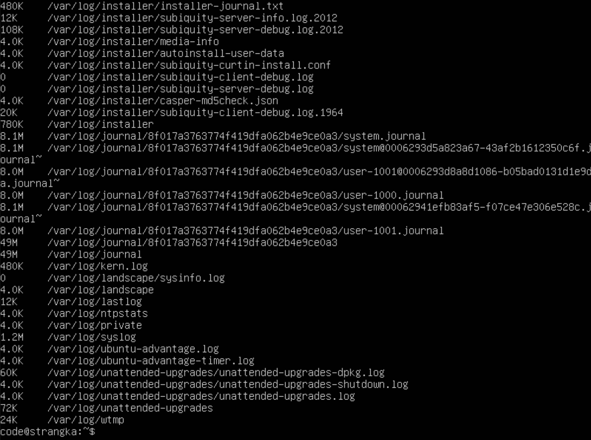

# Part 13. Установка и использование утилиты ncdu

## Установить утилиту ncdu.

1. Команда: sudo apt-get install ncdu.

## Вывести размер папок /home, /var, /var/log.

2. ncdu /home, /var, /var/log.

# Part 14. Работа с системными журналами

## Открыть для просмотра:

1. /var/log/dmesg.

2. /var/log/syslog.

3. /var/log/auth.log.

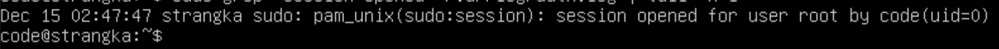

2. Перезапускаем ssh с помощью команды: /etc/init.d/ssh restart. В /var/log/syslog отображается эта информация.

3. В /var/log/auth.log отображается информация по авторизации, имени пользователя и метода входа в систему.

# Part 15. Использование планировщика заданий CRON

## Используя планировщик заданий, запустите команду uptime через каждые 2 минуты.

1. Для запуска cron нужно установить его командой: sudo apt install cron. Далее командой: crontab -e создается файл, где нам предлагают выбрать текстовый редактор на ваш выбор, в дальнейшем будет использоваться именно он. Прописываем в файле */2 * * * * uptime, сохраняем и закрываем файл.

2. Командой: crontab -l показываем список текущих задач.

## Удалите все задания из планировщика заданий.

3. Команда: crontab -r удаляет все задачи из cron и командой: crontab -l проверяем, что нет никаких текущих задач.

