# Сети в Linux

## Part 1. Инструмент ipcalc.

### 1.1 Сети и маски:

1. Адрес сети 192.167.38.54/13.

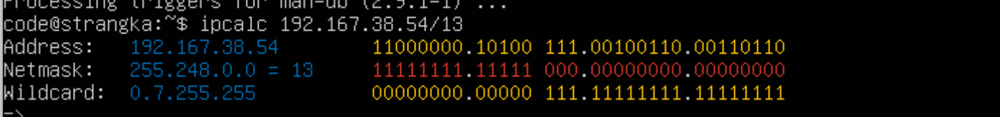

2. Перевод маски 255.255.255.0 в префиксную и двоичную запись, /15 в обычную и двоичную, 11111111.11111111.11111111.11110000 в обычную и префиксную.

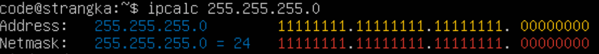
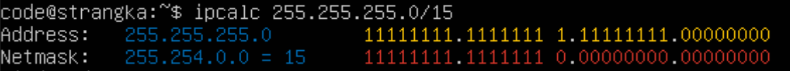
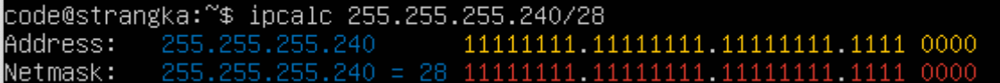

3. Минимальный и максимальный хост в сети 12.167.38.4 при масках; /8, 11111111.11111111.00000000.00000000, 255.255.254.0 и /4.

- Для маски /8:

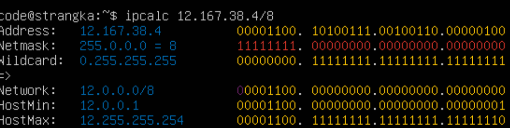

- Для маски 11111111.11111111.00000000.00000000:

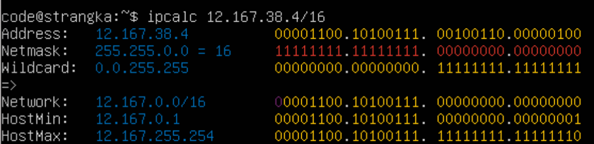

- Для маски 255.255.254.0:

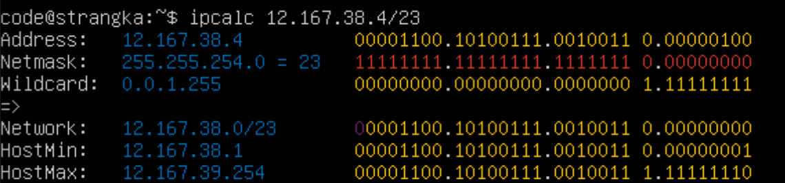

- Для маски /4:

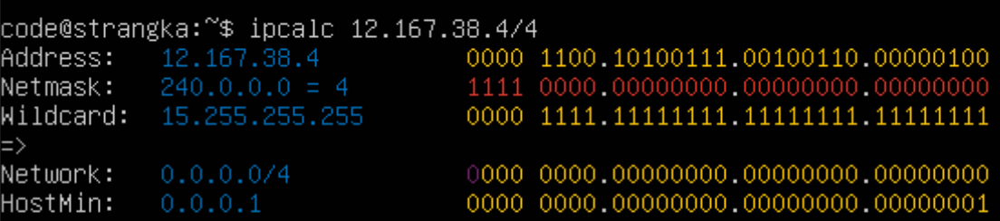

### 1.2. localhost:

Определить и записать в отчёт, можно ли обратиться к приложению, работающему на localhost, со следующими IP: 194.34.23.100/16, 127.0.0.2/24, 127.1.0.1/8, 128.0.0.1/8.

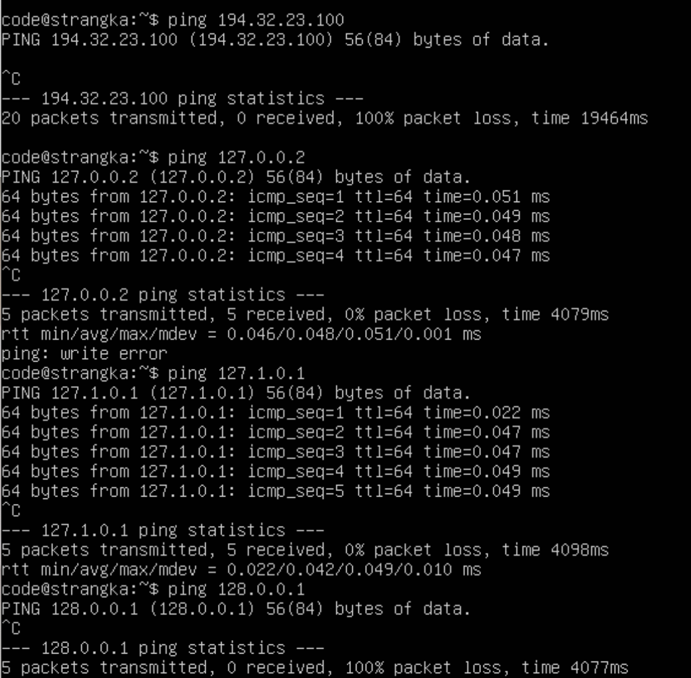

- По адресам 194.34.23.100/16 и 128.0.0.1/8 обратиться к приложению не получится.
- У 127.0.0.2/24 и 127.1.0.1/8 к ним обратиться можно.

### 1.3. Диапазоны и сегменты сетей:

Частные IP-адреса определены в следующих диапазонах:

- 10.0.0.0 - 10.255.255.255
- 172.16.0.0 - 172.31.255.255
- 192.168.0.0 - 192.168.255.255

Все остальнве - публичные.

1) IP-адреса:

- 10.0.0.45/8 - Частный
- 134.43.0.2/16 - Публичный
- 192.168.4.2/16 - Частный
- 172.20.250.4/12 - Частный
- 172.0.2.1/12 - Публичный
- 192.172.0.1/12 - Частично частный
- 172.68.0.2/12 - Публичный
- 172.16.255.255/12 - Частный
- 10.10.10.10/8 - Частный
- 192.169.168.1/16 - Публичный

2) какие из перечисленных IP адресов шлюза возможны у сети 10.10.0.0/18:

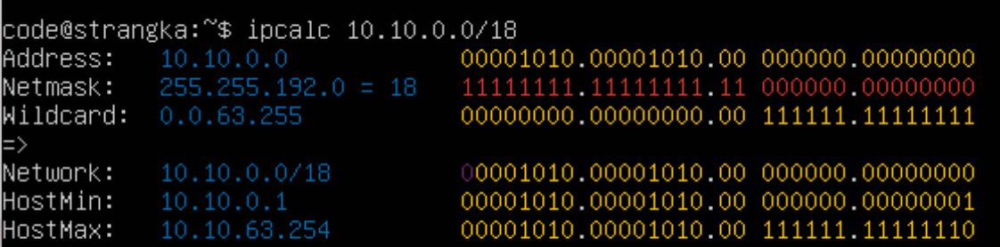

- 10.10.0.2
- 10.10.10.10
- 10.10.1.255

## Part 2. Статическая маршрутизация между двумя машинами

Вывод ip a:

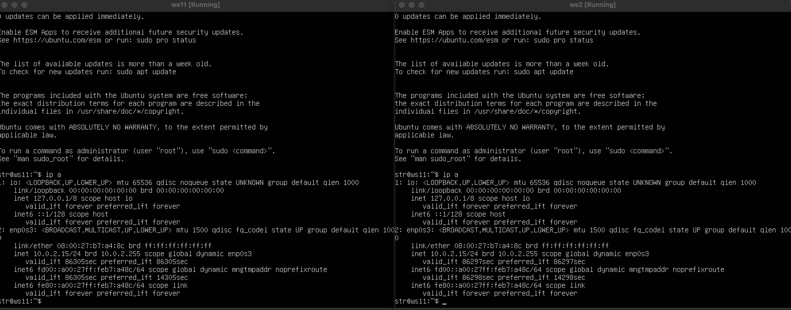

Чтобы проложить сеть между машинами, нам нужно:
1. Настроить netplan с помощью /etc/netplan/00-installer-config.yaml
2. Запустить sudo netplan apply, для применения настроек

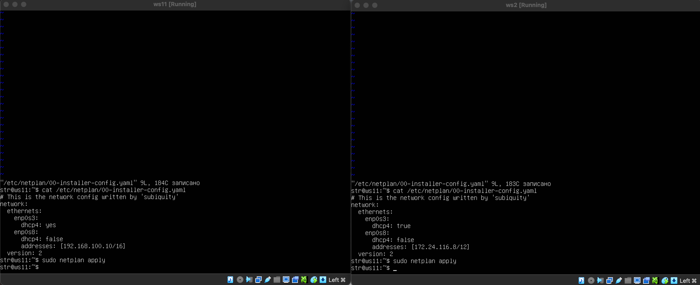

### 2.1. Добавление статического маршрута вручную

Для ручной настройки статического маршрута выполните ip r add (another machine ip) dev enp0s8

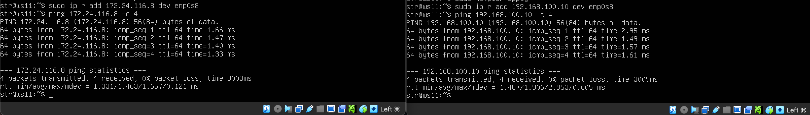

### 2.2. Добавление статического маршрута с сохранением

Запустить /etc/netplan/00-installer-config.yaml, добавить маршруты, проверить ping

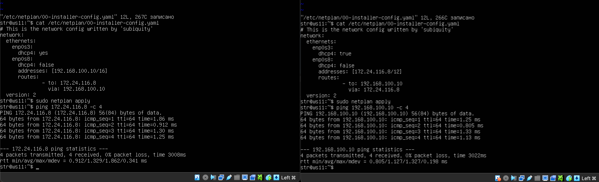

## Part 3. Утилита iperf3

### 3.1 Скорость соединения

8 Mbps = 1 MS/s.
100 MBs = 100000 Kbps.
1 Gbps = 1000 Mbps.
3.2 Утилита iperf3

Для проверки скорости соединения через iperf3, запустить:
sudo iperf3 -s на ws1
sudo iperf3 -c 192.168.100.10 на ws2

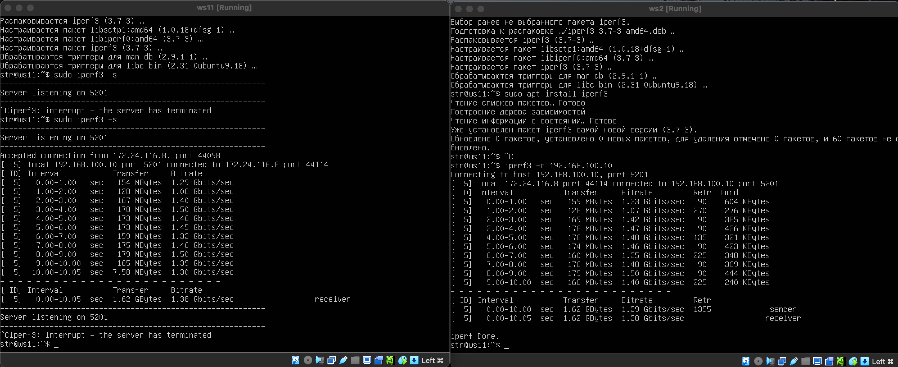

## Part 4. Сетевой брандмауэр

### 4.1 Утилита iptables (sudo apt install iptables.)

1. Создать брандмауэр, имитирующий брандмауэр на ws1 и ws2
2. Запустить файлы на обеих машинах с помощью chmod +x /etc/firewall.sh и /etc/firewall.
Разница в том, что мы сначала настроили drop на ws1, поэтому эта машина не может быть пропингована.

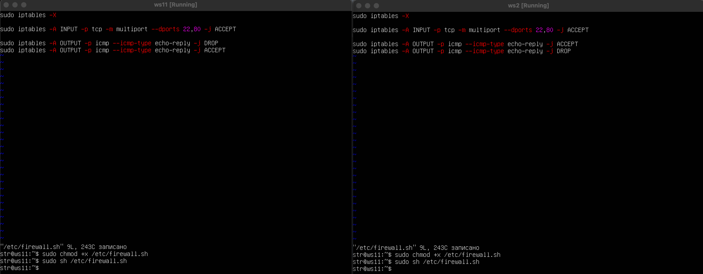

### 4.2 Утилита nmap

Ws1 не отвечает на запросы, хотя его хост запущен, проверив это с помощью nmap.

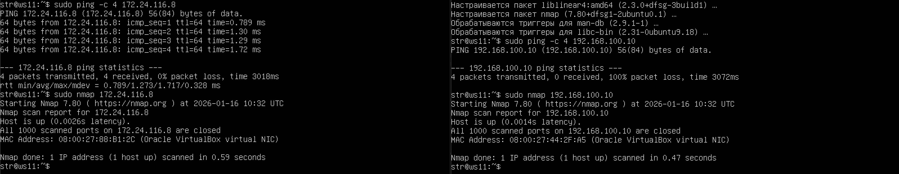

## Part 5. Статическая маршрутизация сети

Запустите пять виртуальных машин (3 рабочие станции (ws11, ws21, ws22) и 2 маршрутизатора (r1, r2))

В настройках виртуальной машины настройте сеть должным образом:
Для r1: Adapter 1 (Internal Network, r1-ws11), Adapter 2 (Internal Network, r1-r2), Adapter 3 (NAT)
Для r2: Adapter 1 (Internal Network, r1-r2), Adapter 2 (Internal Network, r2-ws21-ws22), Adapter 3 (NAT)
Для ws11: Adapter 1 (Internal Network, r1-ws11), Adapter 2 (NAT)
Для ws21, ws22: Adapter 1 (Internal Network, r2-ws21-ws22), Adapter 2 (NAT)

### 5.1. Настройка адресов компьютеров

1. Настроить конфигурации компьютера в etc/netplan/00-installer-config.yaml:
2. Перезапустить сетевую службу через sudo netplan apply.
3. Проверить правильность адреса компьютера с помощью команды ip -4 a.

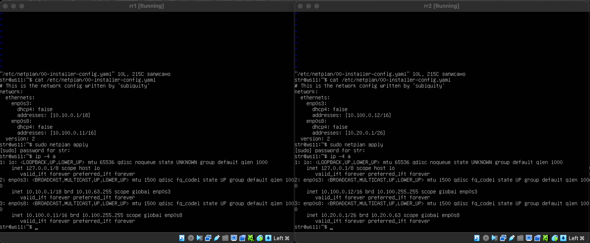
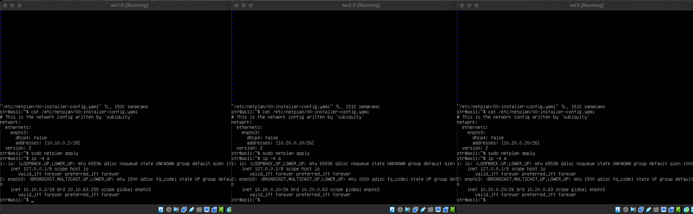

Ping ws22 из ws21 и r1 из ws11:

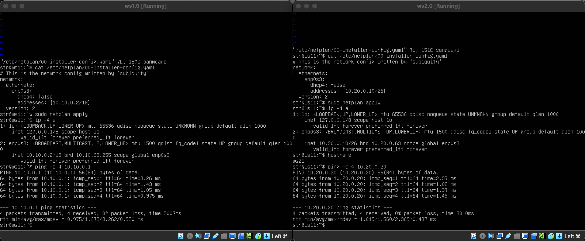

### 5.2. Включение переадресации IP

Чтобы включить переадресацию IP: sysctl -w net.ipv4.ip_forward=1. Переадресация не будет работать после перезагрузки системы.

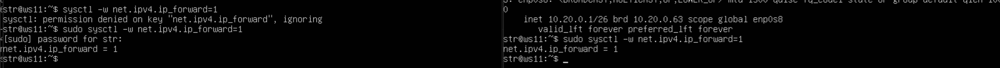

Откройте файл /etc/sysctl.conf и раскомментируйте следующую строку: net.ipv4.ip_forward = 1. Переадресация IP-адресов включена постоянно.

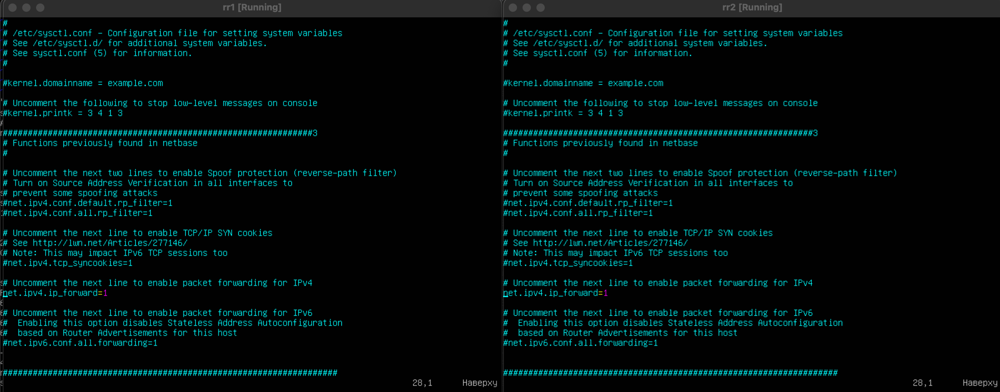

### 5.3. Конфигурация маршрута по умолчанию

1. Настроить маршрут (шлюз) по умолчанию для рабочих станций. Для этого добавьте routes перед IP маршрутизатора в файле конфигурации.
2. Применить с помощью sudo netplan apply и проверить, сработало ли это с ip r.

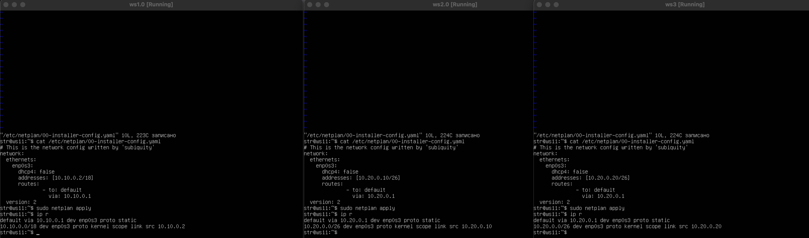

### 5.4. Добавление статических маршрутов

1. Добавить статические маршруты в r1 и r2 в файле конфигурации.
2. Вызвать ip r, показать таблицы маршрутов на обоих маршрутизаторах.

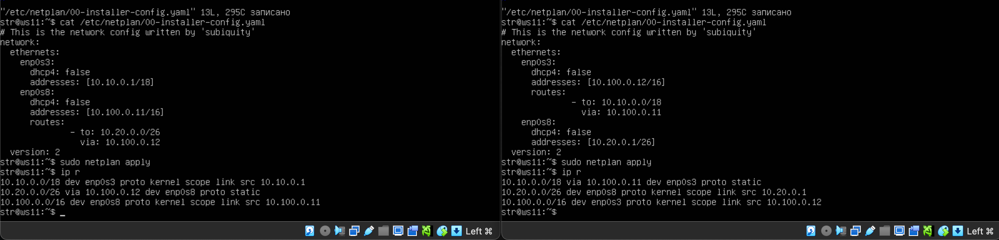

3. Запустить команды ip r list 10.10.0.0/[netmask] и ip r list 0.0.0.0/ 0 на ws11.

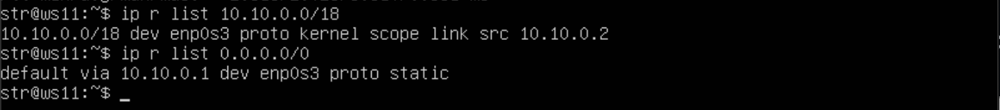

Адрес 0.0.0.0/0 - любой адрес, а значит, команда ip r list 0.0.0.0/0 выведет все возможные маршруты, доступные на этом устройстве. Результат команды ip r list 10.10.0.0/18 будет отличаться, так как этот адрес есть в сети устройства, и нет необходимости обращаться к маршрутизатору для дальнейшей передачи пакета.

Ping ws11 -> r2:

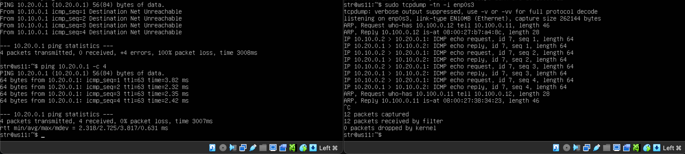

### 5.5. Составление списка маршрутизаторов

1. Запустить команду дампа tcpdump -tnv -i enp0s3 на r1
2. Использовать утилиту traceroute(tracapath) для составления списка маршрутизаторов по пути ws11 -> ws21

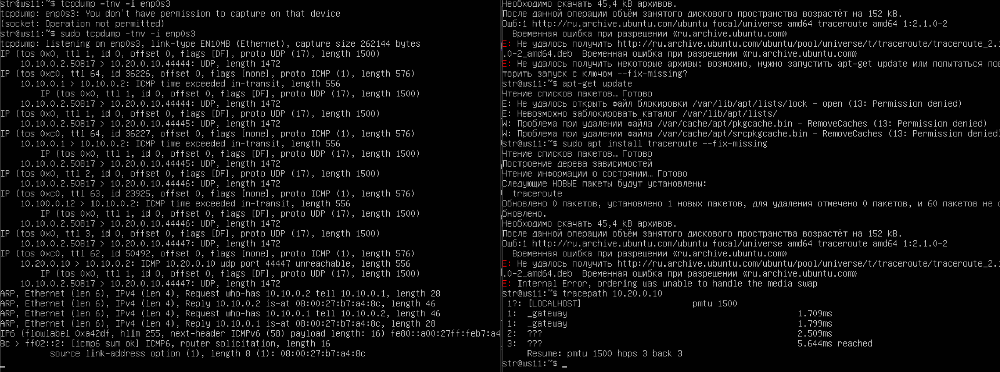

### 5.6. Использование протокола ICMP при маршрутизации

1. Запустить на r1 сбор сетевого трафика, проходящего через eth0, с помощью tcpdump -n -i enp0s3.
2. Пропинговать несуществующий IP (например, 10.30.0.111) из ws11 с помощьюping -c 1 10.30.0.111 команды.

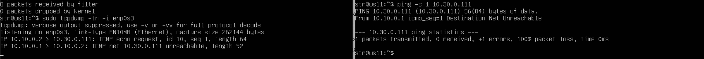

## Part 6. Динамическая настройка IP с использованием DHCP

Указать адрес маршрутизатора по умолчанию, DNS-сервер и адрес внутренней сети. (r2): /etc/dhcp/dhcpd.conf

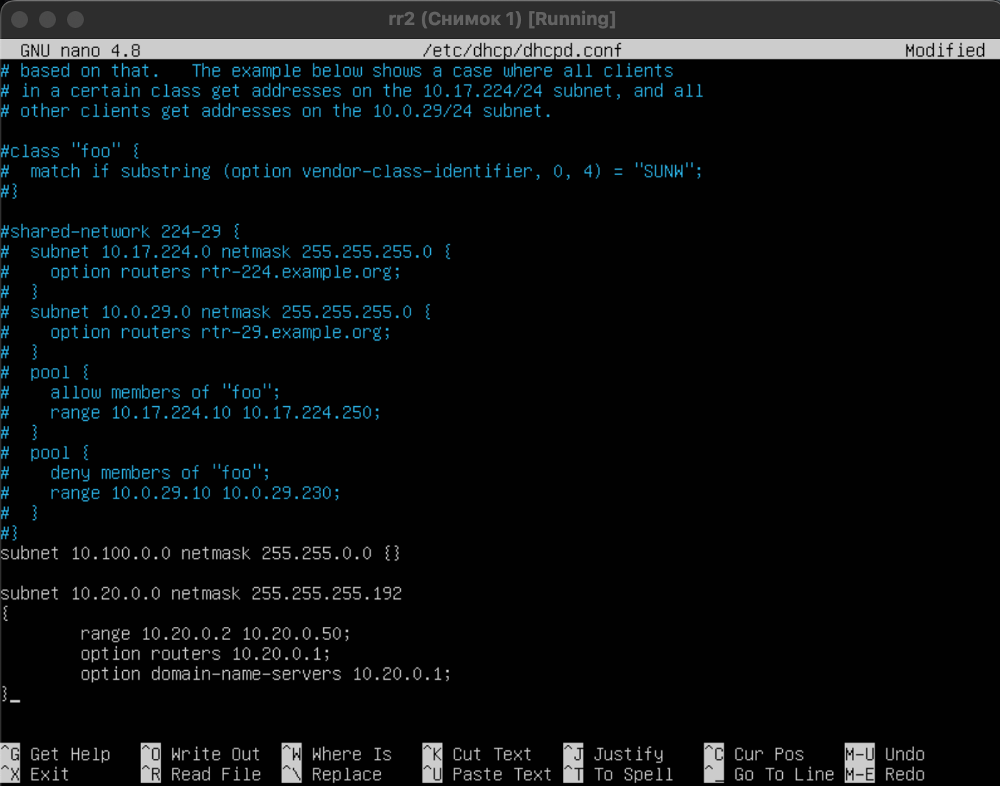

Определить сервер имен как 8.8.8.8 в resolv.conf: /etc/resolv.conf

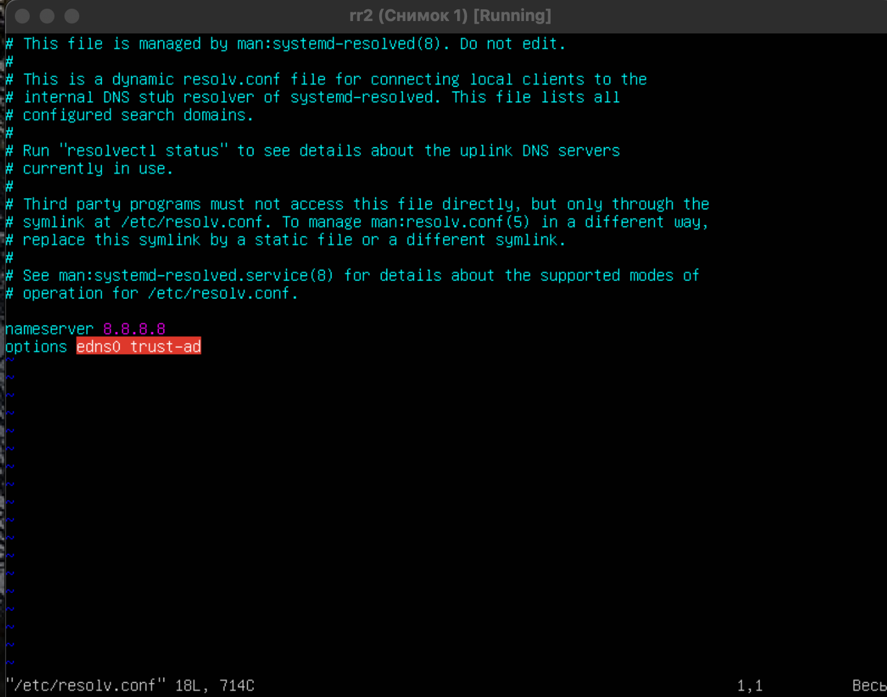

Перезапустить службу DHCP, пропинговать ws21->ws22:

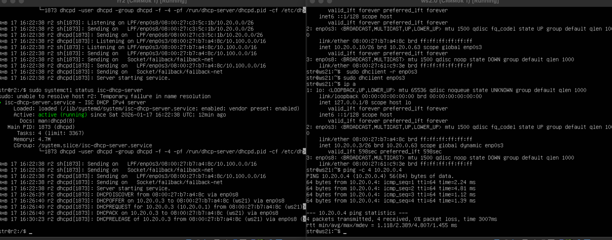

Настройте MAC-адрес ws11 в настройках виртуальной машины и в netplan, также изменить его в vbox:

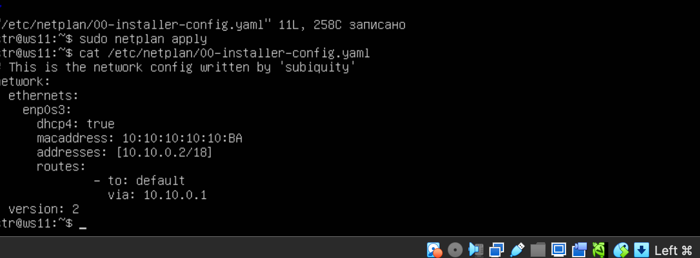

Настройте r1 так же, как r2, но сделайте назначение адресов строго привязанным к MAC-адресу (ws11), /etc/dhcp/dhcpd.conf:

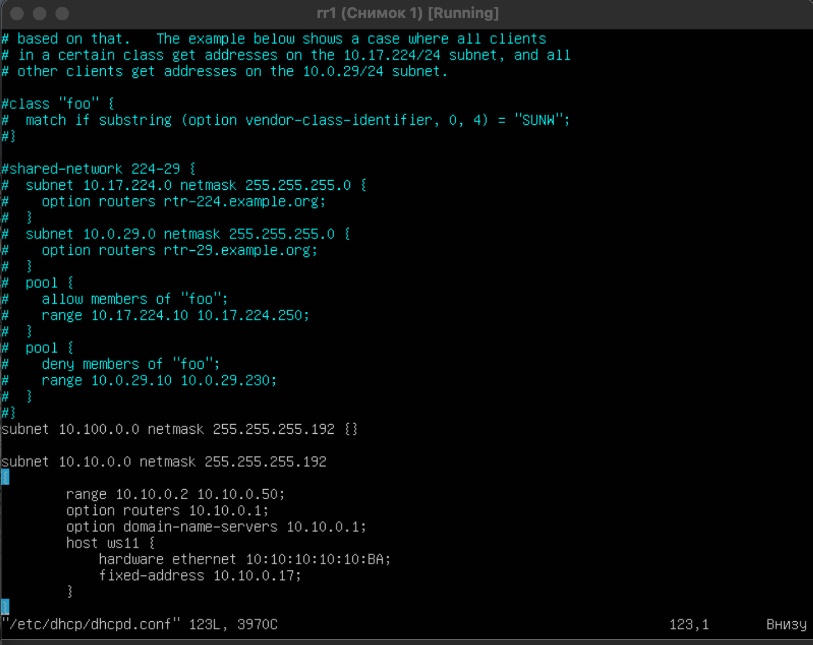

/etc/resolv.conf

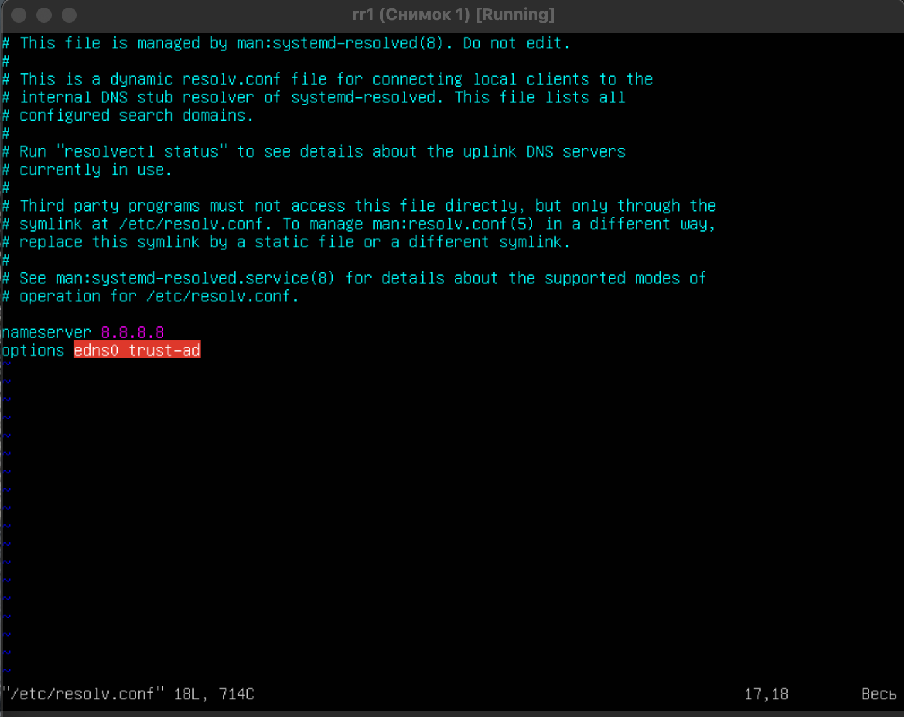

Перезагрузить сервер, определить новый IP-адрес ws11:

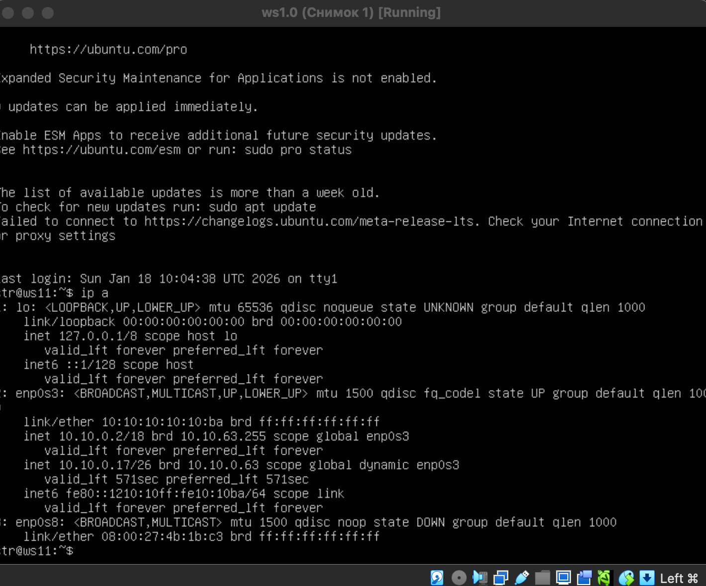

Запросить обновление ip -адреса у ws21:

1. Запустить sudo dhclient -r enp0s3, чтобы удалить старый ip.

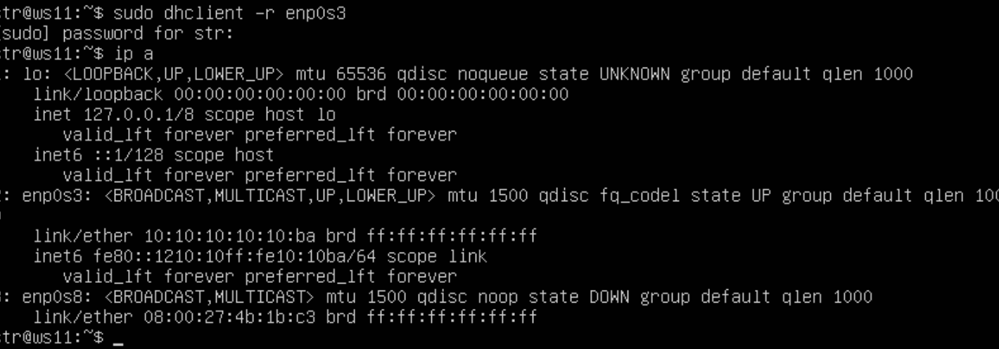

2. Запустить sudo dhclient -v enp0s3, чтобы запросить новый ip

## Part 7. NAT

В файле /etc/apache2/ports.conf изменить строку Listen 80 на Listen 0.0.0.0:80 на ws22 и r1, сделать сервер общедоступным, /etc/apache2/ports.conf:

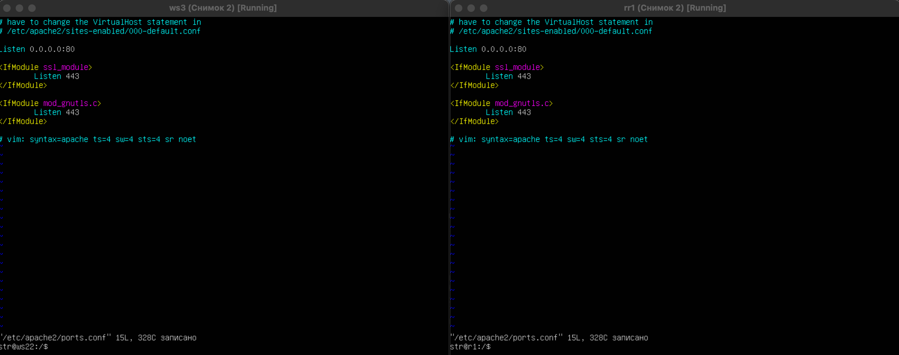

Запусть веб - сервер Apache с помощью service apache2 start команды на ws22 и r1:

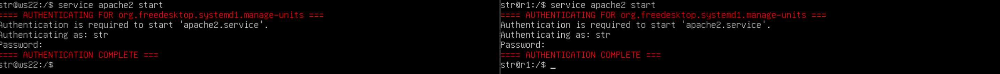

1. Добавить следующие правила в брандмауэр, созданный аналогично брандмауэру из части 4, на r2:
удалить правила в таблице фильтров - iptables -F
удалить правила в таблице "NAT" - iptables -F -t nat
удалить все маршрутизируемые пакеты - iptables --политика ПРЯМОГО УДАЛЕНИЯ
2. Запустить файл.

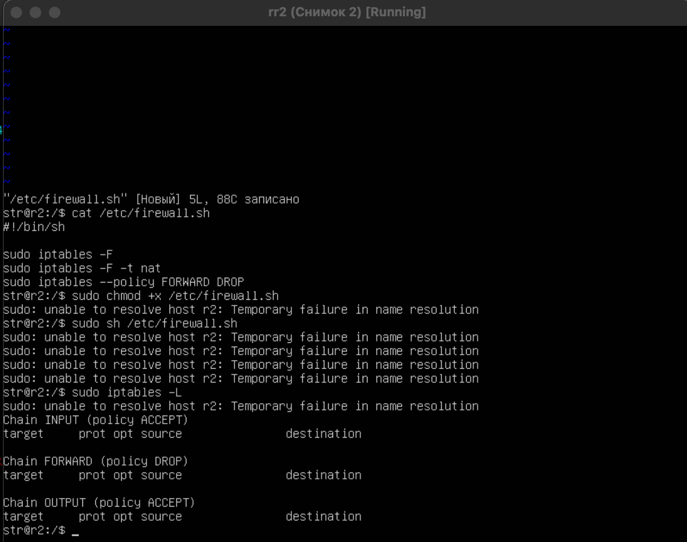

При запуске файла с этими правилами ws22 не должен выполнять пинг с r1:

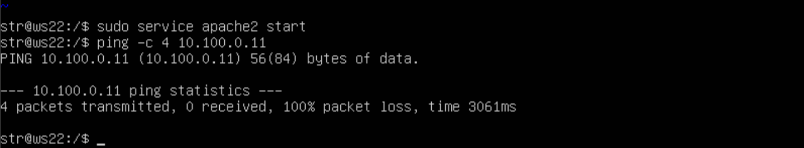

1. Добавить в файл еще одно правило: разрешить маршрутизацию всех пакетов протокола ICMP.
2. Запустить файл.
3. Проверить соединение между ws22 и r1 с помощью команды ping.

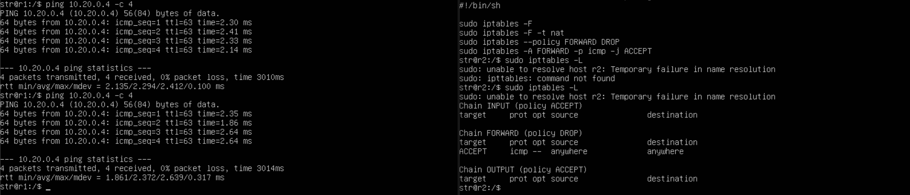

1. Добавьте в файл еще два правила:
включить SNAT, который маскирует все локальные ip-адреса из локальной сети за r2 (как определено в части 5 - сеть 10.20.0.0)
включите DNAT на порту 8080 компьютера r2 и добавьте внешний сетевой доступ к веб -серверу Apache, работающему на ws22

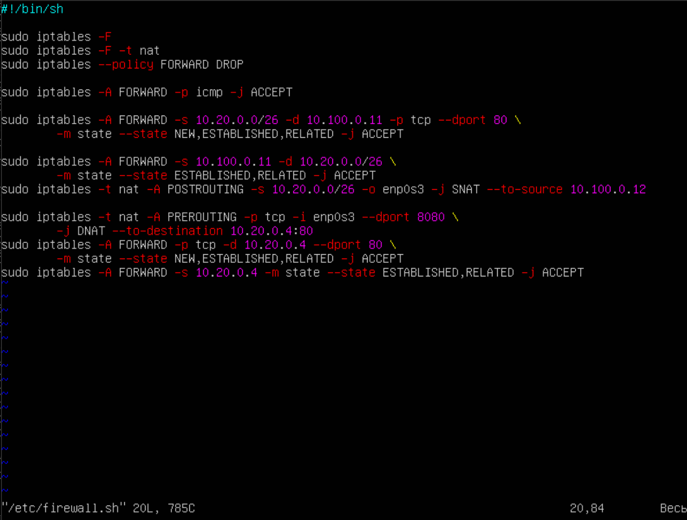

2. Проверить TCP-соединение на наличие SNAT, подключившись из ws22 к серверу Apache на r1 с помощью команды telnet (я использовал nc/curl):
3. Проверить TCP-соединение на наличие DNAT, подключившись с r1 к серверу Apache на ws22 с помощью команды telnet(я использовал nc/curl),
адрес r2 и порт 8080:

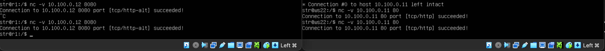